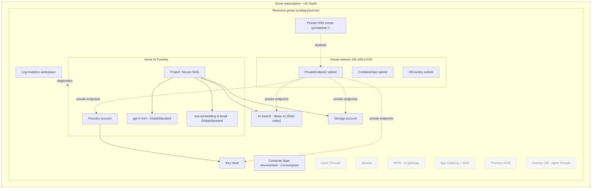
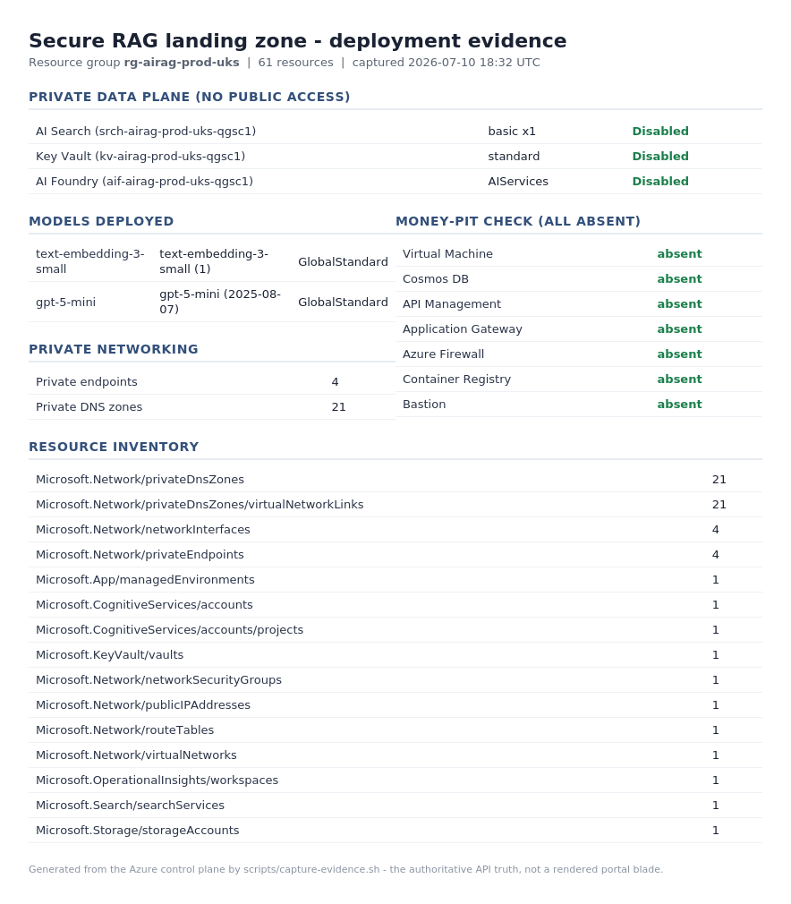
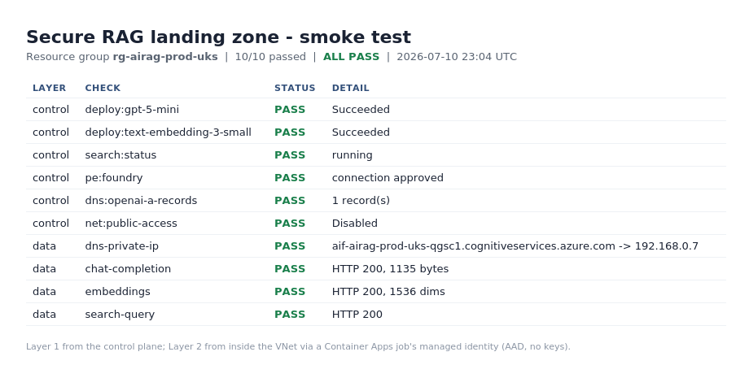

# ai-landing-zone-starter

An opinionated, deploy-ready **reference deployment** of a secure Azure AI landing zone for a regulated UK SME, built **on** Microsoft's official Azure AI Landing Zone Verified Module ([`Azure/avm-ptn-aiml-landing-zone`](https://registry.terraform.io/modules/Azure/avm-ptn-aiml-landing-zone/azurerm/latest), pinned to `0.5.1`).

It is deliberately **not** a new landing-zone module - Microsoft's is official, AVM-based and maintained. The value here is the judgment layer their generic module does not carry: an opinionated golden-path configuration for one real scenario, deployed for real, with the cost and the decisions written down.

> The decision log and Well-Architected mapping below are the point of this repo. They are an Azure Well-Architected Review in miniature: what good looks like on top of the generic module, and why.

## Scenario

A **secure Retrieval-Augmented Generation (RAG) application for a regulated UK SME**. A small, compliance-conscious business wants to put a private chat-over-your-documents assistant in front of its staff, with:

- **UK data residency** - everything in **UK South**.
- **No public data plane** - Azure OpenAI, AI Search, Key Vault and Storage reachable only over **private endpoints**, resolved through **private DNS** inside the virtual network.
- **Consumption-first economics** - pay-per-token models, no always-on appliances, nothing that bills while idle beyond the one component that has no cheaper private tier.

The workload is Azure AI Foundry (account + project) with a chat model and an embedding model, an Azure AI Search index for retrieval, and an Azure Container Apps environment ready to host the app - all private.

## Architecture

What actually deploys on the golden path (solid), and what is expressed in code but flagged **off** by default (dashed):



Dashed nodes are money-pit or unneeded resources the pattern module deploys by default; this reference turns them off and documents why (see the decision log). Flip a single flag to bring any of them back.

## What deploys vs what is off

| Component | State | Why |
| --- | --- | --- |
| AI Foundry account + project | **On** | The workload. |
| gpt-5-mini + text-embedding-3-small | **On** | Chat + embeddings for RAG, both GlobalStandard (pay-per-token). |
| AI Search (Basic, 1 replica) | **On** | The retrieval index. The one component with no cheaper private-capable tier. |
| Key Vault + Storage (Foundry BYOR) | **On** | Foundation the Foundry account requires. |
| Container Apps environment | **On** | Where the RAG app runs; Consumption profile, near-zero idle. |
| Log Analytics | **On** | Diagnostics; consumption ingestion. |
| Private endpoints + private DNS | **On** | The "secure/private" in the scenario. |
| Azure Firewall | Off (`enable_firewall`) | Money-pit; inherit the hub firewall in a real ALZ. |
| Bastion / jump VM / build VM | Off | Standing infrastructure not needed for a capture-and-destroy demo. |
| APIM (AI gateway) | Off (`enable_apim`) | The module defaults it **on at Premium_3**. Expressed and documented as the recommended production add-on. |
| Application Gateway + WAF | Off (`enable_app_gateway`) | Money-pit; only needed to publish the app to the public internet. |
| Premium ACR | Off (`enable_container_registry`) | Premium-only for private link; nothing to store until you bring a container image. |
| Cosmos DB | Off | Only needed for the Foundry agent service, which is off. |
| Bing grounding | Off | A public-internet grounding source contradicts the private-only design. |
| DDoS Standard / provisioned throughput (PTU) | Off | Never created; models are GlobalStandard only. |

## Deployment evidence

Deployed for real, captured from the Azure control plane, then torn down. The
data plane is private (public access disabled on Search, Key Vault and Foundry),
both models are live on GlobalStandard, and every money-pit resource is absent -
exactly as the tables above claim. Regenerate with `scripts/capture-evidence.sh`.



## Smoke test

Deploying is not the same as working. `scripts/smoke-test.sh` proves the estate
actually functions, in two layers:

- **Control plane** (from anywhere): model deployments `Succeeded`, Search running, private-endpoint connections `Approved`, private DNS A-records present, public access `Disabled`.
- **Data plane** (from *inside* the VNet): a short-lived Container Apps job in the deployed environment resolves the private FQDN, then calls chat, embeddings and Search over the private path using its own managed identity (AAD, no keys). Container Apps is used rather than a VM so it works even where VM SKUs are restricted.

It earned its keep on the first run: every control-plane check passed, but the
data-plane DNS check failed - the private zones were empty (see the DNS zone-group
decision above). One flag later, the re-run is green end to end, including a live
`gpt-5-mini` completion and a 1536-dimension embedding from inside the VNet:



## Decision log

Each row is a deliberate departure from the pattern module's defaults. "Default" is what `avm-ptn-aiml-landing-zone` 0.5.1 does out of the box.

| Decision | Module default | This reference | Rationale |
| --- | --- | --- | --- |
| **Standalone mode** (`flag_platform_landing_zone = false`) | `true` - assumes a platform hub supplies private DNS and egress | `false` | With the flag `true` and no platform hub present, the module creates private endpoints but **no private DNS zones**, so nothing resolves and the private RAG story does not work. `false` makes the module self-contained. In a real ALZ, set it `true` and inherit the hub firewall and central DNS - a one-line change. |
| **Create DNS zone groups** (`private_dns_zones.azure_policy_pe_zone_linking_enabled = false`) | `true` - assumes an Azure Policy links private endpoints to their DNS zones | `false` | The deepest of the "private" gotchas, and the one the smoke test caught. Left at the default, the module creates the private DNS zones but **not the zone groups** on the endpoints - it expects an Azure Policy to populate the A-records. A bare subscription has no such policy, so the zones stay empty and the private FQDNs never resolve: the deploy "succeeds", every control-plane check passes, but the RAG is unreachable. Setting this `false` makes the module create the zone groups itself. |
| **APIM off** | **On, `Premium_3`** (the module's single largest cost) | Off; Developer SKU when enabled | The biggest hidden money-pit in the module. Kept in code and documented as the production AI gateway (token metering and per-consumer quotas over Azure OpenAI); when flipped on it uses Developer, not Premium_3. |
| **AI Search Basic x1** | `standard`, 2 replicas | `basic`, 1 replica | Azure AI Search has no consumption tier and no private-link support below Basic. Basic at one replica is the genuine floor for private RAG and the only meaningful standing cost here. |
| **Cosmos DB off** | On | Off | Cosmos backs the Foundry agent thread store. The agent service is off (pure retrieve-and-generate needs no thread persistence), so Cosmos is pure idle spend. Turn both on together if you add agents. |
| **ACR off** | **On, `Premium`** | Off | Premium is the only ACR tier with private link, and it bills whether or not it holds an image. The reference ships no container image, so an empty Premium registry is waste. |
| **Bing grounding off** | On (`G1`) | Off | Grounding answers against public Bing results, which contradicts a private, data-resident design. |
| **Single search, not two** | Both a Foundry BYOR search **and** a top-level knowledge search | One (the Foundry BYOR search, wired to the project) | The module's examples stand up two AI Search services. One index, connected to the project, is what RAG needs. |
| **Edge appliances off** | Firewall/Bastion/VMs default on once standalone | All off via flags | None are needed for a deploy-capture-destroy demo; each is a standing cost. |
| **App Gateway stub always forwarded** | `app_gateway_definition` defaults to `null` | A complete `deploy = false` stub in `locals.tf` | The module reads `.deploy` without `try()`, so a null value errors at plan time and the object carries five required maps. The wrapper always forwards a valid stub and only toggles `deploy`. |
| **GlobalStandard models only** | No models deployed | gpt-5-mini + text-embedding-3-small, GlobalStandard | GlobalStandard is pay-per-token; `ProvisionedManaged` (PTU) is a four-figure monthly commitment and is never selected. The model pair is the cheaper, current default a cost-conscious SME should start on - and, verified live, the two OpenAI models a fresh Sponsorship subscription actually has GlobalStandard quota for. Raise to gpt-4.1 / text-embedding-3-large by editing one map once quota is granted. |
| **Project auto-connections off** | Connections wire Search, Storage **and** a mandatory Cosmos role assignment | `create_project_connections = false` | The module couples project connections to a required Cosmos DB id. Cosmos' only consumer (the agent service) is off, so wiring connections would force an unused Cosmos DB. The project, models, search, Key Vault and Storage still deploy; enabling connections is a one-line change that also switches Cosmos on. |
| **Firewall public IP (known quirk)** | Standalone mode creates a firewall public IP regardless of `firewall.deploy` | Accepted and documented | The module gates the firewall public IP on standalone mode alone, not on whether a firewall is deployed, so it provisions an orphaned Standard public IP (~£0.005 / hr) even with the firewall off. It cannot be flagged away without adopting a platform hub or a BYO VNet; it disappears in a real ALZ (`flag_platform_landing_zone = true`). A good example of a buried cost the toggles do not cover. |
| **Purge on destroy** | `false`; purge protection on Key Vault | `purge_on_destroy = true`, purge soft-delete on destroy | Deploy-capture-destroy must be repeatable; without this, soft-deleted Key Vault / Foundry names block the next deploy. |

## Naming convention

Resource names follow the Microsoft Cloud Adoption Framework (CAF) pattern:

```
<resource-type-abbreviation>-<workload>-<environment>-<region>[-<unique>]
```

driven by three tokens (`workload` = `airag`, `environment` = `prod`, `region_abbreviation` = `uks`), so the estate reads as, for example, `rg-airag-prod-uks`, `vnet-airag-prod-uks`, `aif-airag-prod-uks-a1b2c`. The abbreviations are the current CAF [resource abbreviations](https://learn.microsoft.com/en-us/azure/cloud-adoption-framework/ready/azure-best-practices/resource-abbreviations): `rg`, `vnet`, `nsg`, `log`, `cae`, `aif` (AI Foundry account), `proj`, `srch`, `kv`, `st`, plus `afw`/`bas`/`agw`/`apim`/`cr` for the flag-gated edge.

Two deliberate details:

- **Globally-unique resources** (Foundry account, AI Search, Key Vault, Storage, ACR) carry a short random suffix - the same mechanism as the official `Azure/naming` module's `name_unique` - because their names form global DNS labels. Storage drops the hyphens (`st<workload><environment><region><unique>`) to satisfy the 3-24 lowercase-alphanumeric rule, and the 24-char names are length-guarded.
- **The names built by hand, not by the `Azure/naming` module.** That module's slugs still lag the current CAF table (it emits `fw`, `snap`, `cog`, `acr`, `pe` rather than `afw`, `bas`, `ais`/`aif`, `cr`, `pep`), so composing the names in `locals.tf` is both more CAF-correct and self-documenting.

A handful of sub-resource names (private endpoints, NICs, the route table, the firewall public IP, DNS VNet links) are generated by the pattern module itself from its `name_prefix` input, which we set to the workload token. Those carry the workload but keep the module's own format - the pattern module does not expose per-resource name overrides for them.

## Well-Architected Framework mapping

How the configuration maps to the five pillars - the same lens an Azure Well-Architected Review applies.

**Security.** No public data plane: Azure OpenAI, AI Search, Key Vault and Storage are private-endpoint only, with public network access disabled and private DNS resolving inside the VNet. Managed identities and Key Vault hold secrets; local authentication is disabled where the module supports it. UK South keeps data in-region. The documented production path adds APIM in front of Azure OpenAI for token governance, and a WAF-fronted Application Gateway to publish the app.

**Cost Optimisation.** The core discipline. Consumption and serverless tiers throughout: pay-per-token models, Consumption Container Apps, per-operation Key Vault. Every always-on appliance (Firewall, Bastion, APIM, App Gateway, ACR) is off by default. The one irreducible standing cost - Basic AI Search - is called out explicitly rather than buried. Tags carry a cost-centre for showback.

**Operational Excellence.** Everything is code: one pinned module version, a remote state backend, and CI that runs `fmt`, `validate`, `tflint`, `checkov` and `gitleaks` on every change. Diagnostics flow to Log Analytics. `purge_on_destroy` makes the environment reproducible. The decision log is the operational record of why the estate looks as it does.

**Reliability.** The private DNS and endpoint topology is created deterministically by the module. For a demo, single-replica Search and consumption tiers are deliberate; the same code scales up by raising `replica_count` and enabling zone-redundant tiers. Remote state with locking prevents concurrent-apply corruption.

**Performance Efficiency.** GlobalStandard model deployments draw on Azure's shared capacity with no cold provisioned pool to size. AI Search partitions and replicas are explicit inputs, so retrieval throughput scales independently of the models. Container Apps scales the app tier to zero when idle.

## Cost

Approximate UK South list prices, ex VAT. Treat as indicative and confirm against the [Azure pricing calculator](https://azure.microsoft.com/pricing/calculator/); model token costs depend entirely on usage.

**Golden path (all flags off) - roughly what it costs while running:**

| Component | Approx cost | Notes |
| --- | --- | --- |
| AI Search - Basic, 1 replica | ~£0.08 / hr (~£58 / mo) | The only meaningful standing cost. No private-capable tier is cheaper. |
| Private endpoints (~6-8) | ~£0.05 / hr | ~£0.008 / hr each plus per-GB processing. |
| Private DNS zones | ~£0.01 / hr | Fractions of a penny per zone. |
| Firewall public IP (module quirk) | ~£0.005 / hr | Orphaned Standard public IP the module creates in standalone mode; see the decision log. |
| Container Apps environment | ~£0 idle | Consumption; billed per vCPU-second when an app runs. |
| Log Analytics | ~£0 idle | Pay-per-GB ingested. |
| Key Vault / Storage | pennies / day | Per-operation and per-GB. |
| Azure OpenAI (gpt-5-mini, embeddings) | £0 idle | Pay-per-token; nothing until you call it. |
| **Total while running** | **~£0.13-0.15 / hr (~£3.50 / day)** | Dominated by the one Basic AI Search. |

**Money-pit flags - why they stay off (approximate):**

| Flag | Approx cost when on |
| --- | --- |
| `enable_apim` (module default: Premium_3) | Premium_3 ~£2,000+ / mo; Developer (used here when on) ~£0.05 / hr |
| `enable_firewall` | Azure Firewall Standard ~£0.90 / hr (~£650 / mo) plus data |
| `enable_app_gateway` | WAF_v2 ~£0.25 / hr plus capacity units |
| `enable_bastion` | Bastion Standard ~£0.17 / hr (~£125 / mo) |
| `enable_container_registry` | Premium ACR ~£40 / mo |
| DDoS Standard (never created) | ~£2,500 / mo |
| Provisioned throughput / PTU (never created) | Four figures / mo per deployment |

## Deploy

Prerequisites: an authenticated Azure CLI (`az login`), Terraform >= 1.9, and access to the shared state backend.

```bash
# 1. Point at the target subscription
az account set --subscription "Microsoft Azure Sponsorship"

# 2. Supply the subscription id without committing it
export TF_VAR_subscription_id=$(az account show --query id -o tsv)

# 3. Initialise (downloads the module + connects to remote state)
terraform init

# 4. Review and apply
terraform plan -out tfplan
terraform apply tfplan
```

To enable any documented add-on, set its flag (for example `enable_apim = true`) in a gitignored `terraform.tfvars` - see [`terraform.tfvars.example`](terraform.tfvars.example).

## Teardown

Nothing is meant to run overnight. Tear down every session:

```bash
terraform destroy
```

`purge_on_destroy` and the provider's purge-soft-delete-on-destroy settings mean Key Vault and Foundry names are fully released, so the next deploy does not collide with soft-deleted reservations. The remote state backend keeps teardown reliable across machines and sessions.

## Capture checklist

Before destroying, capture the evidence for the case study. The API-level proof
is automated - run it while the estate is up:

```bash
scripts/capture-evidence.sh   # writes evidence/evidence.json + evidence-sheet.png
```

It queries the control plane and renders a one-page sheet proving the data plane
is private (public access disabled on Search / Key Vault / Foundry), the two
models are deployed, and every money-pit resource is absent - the authoritative
API truth rather than a rendered portal blade. For visuals, add optionally:

- [ ] Azure portal - resource group overview showing the deployed resources.
- [ ] AI Foundry - the project with both model deployments.
- [ ] Cost analysis / Sponsorships balance view for the running estate.

## CI

Static checks only (no cloud credentials in CI): `terraform fmt` / `validate`, `tflint` (+ Azure ruleset), `checkov` IaC scan, and `gitleaks` secret scan (which fails the build if a real subscription id is ever committed).

## Licence

MIT - see [LICENSE](LICENSE).
